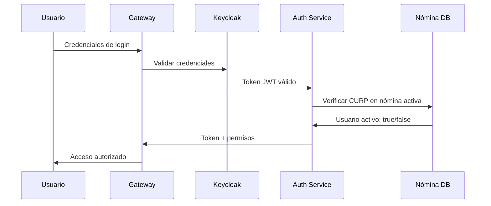
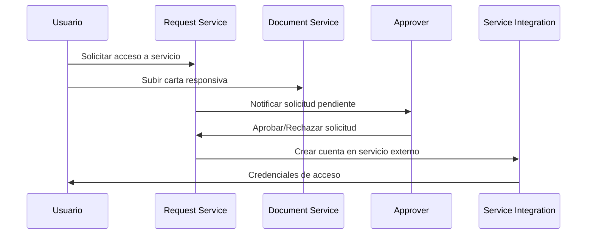

# Sistema de Acceso Unificado - Gobierno de Tabasco

Sistema integral de gestión de accesos para plataformas internas del Gobierno de Tabasco, basado en arquitectura de microservicios con Spring Boot y autenticación centralizada mediante Keycloak.

## 🎯 Objetivo del Proyecto

Crear una **llave maestra** que permita a los empleados del Gobierno de Tabasco acceder de forma unificada a múltiples sistemas internos mediante un proceso de autenticación centralizado y validación de nómina activa.

## 🏛️ Contexto Gubernamental

**Cliente**: Gobierno de Tabasco  
**Propósito**: Sistema de Single Sign-On (SSO) para empleados gubernamentales  
**Alcance**: Acceso unificado a plataformas internas del gobierno  

### Servicios Gestionados
- 📧 **Correo Electrónico Corporativo**
- 💻 **Repositorio de Código (GitLab/GitHub Enterprise)**
- 🏢 **Salas Virtuales (Teams/Zoom)**
- 📄 **Sistema de Cartas Responsivas**
- 🔐 **Otros sistemas internos según necesidad**

## 🏗️ Arquitectura de Microservicios

```
┌─────────────────────────────────────────────────────────────┐
│                    Sistema Acceso Tabasco                  │
├─────────────────────────────────────────────────────────────┤
│  🌐 API Gateway (Spring Cloud Gateway)                     │
│  📋 Config Server (Spring Cloud Config)                    │
│  📍 Service Discovery (Eureka/Consul)                      │
├─────────────────────────────────────────────────────────────┤
│  🔐 Auth Service (Keycloak + Validación Nómina)           │
│  👥 User Management Service (CURP, Nombres, Status)       │
│  📝 Request Management Service (Solicitudes y Aprobaciones)│
│  📧 Email Service Integration                               │
│  💻 Repository Service Integration                          │
│  🏢 Virtual Meeting Service Integration                     │
│  📄 Document Management Service (Cartas Responsivas)       │
└─────────────────────────────────────────────────────────────┘
```

## 🔄 Flujo de Autenticación y Autorización

### 1. Proceso de Login


### 2. Proceso de Solicitud de Servicios


## 📋 Base de Datos - Vista de Usuarios

### Estructura de la Vista `vw_empleados_nomina`
```sql
CREATE VIEW vw_empleados_nomina AS
SELECT 
    curp VARCHAR(18) PRIMARY KEY,
    nombres VARCHAR(100) NOT NULL,
    apellido_paterno VARCHAR(50),
    apellido_materno VARCHAR(50),
    email VARCHAR(100),
    dependencia VARCHAR(100),
    puesto VARCHAR(100),
    status_nomina ENUM('ACTIVO', 'INACTIVO', 'SUSPENDIDO') DEFAULT 'ACTIVO',
    fecha_ingreso DATE,
    fecha_actualizacion TIMESTAMP DEFAULT CURRENT_TIMESTAMP
FROM empleados_nomina 
WHERE status_nomina = 'ACTIVO';
```

## 🚀 Componentes del Sistema

### 🌐 Gateway Service
- **Puerto**: 8080
- **Responsabilidad**: Punto de entrada único, balanceador de carga, rate limiting
- **Tecnología**: Spring Cloud Gateway + OAuth2

### 📋 Config Server
- **Puerto**: 8888
- **Responsabilidad**: Gestión centralizada de configuraciones
- **Repositorio**: Git para versionado de configuraciones

### 📍 Service Discovery
- **Puerto**: 8761
- **Responsabilidad**: Registro y descubrimiento de servicios
- **Tecnología**: Eureka Server

### 🔐 Authentication Service
- **Puerto**: 8081
- **Responsabilidad**: Validación de usuarios en nómina, integración con Keycloak
- **Base de datos**: MySQL/PostgreSQL

### 👥 User Management Service  
- **Puerto**: 8082
- **Responsabilidad**: Gestión de perfiles de usuario, CURP, datos personales
- **Funcionalidades**:
  - Consulta de datos de nómina
  - Actualización de perfiles
  - Gestión de roles y permisos

### 📝 Request Management Service
- **Puerto**: 8083  
- **Responsabilidad**: Gestión de solicitudes de acceso a servicios
- **Funcionalidades**:
  - Crear solicitudes
  - Workflow de aprobaciones
  - Notificaciones a supervisores
  - Historial de solicitudes

### 📄 Document Service
- **Puerto**: 8084
- **Responsabilidad**: Gestión de cartas responsivas y documentos
- **Funcionalidades**:
  - Upload de documentos PDF
  - Validación de formatos
  - Almacenamiento seguro
  - Versionado de documentos

### 🔌 Integration Services

#### 📧 Email Service (8085)
- Integración con Exchange/Office 365
- Creación automática de cuentas de correo
- Asignación a grupos de distribución

#### 💻 Repository Service (8086)  
- Integración con GitLab/GitHub Enterprise
- Creación de usuarios y asignación de proyectos
- Gestión de permisos por dependencia

#### 🏢 Virtual Meeting Service (8087)
- Integración con Microsoft Teams/Zoom
- Creación de cuentas corporativas
- Asignación de licencias según perfil

## ⚙️ Configuración de Keycloak

### Realm: `gobierno-tabasco`
```yaml
Realm Settings:
  - Realm Name: gobierno-tabasco
  - Display Name: "Sistema Gobierno Tabasco"
  - Login Theme: gobierno-tabasco-theme
  - Email Settings: SMTP del gobierno
  
Clients:
  - gateway-client: Confidential client para API Gateway
  - web-app: Public client para aplicaciones web
  - mobile-app: Public client para apps móviles
  
User Federation:
  - LDAP: Integración con Active Directory gubernamental
  - Database: Vista de empleados de nómina
  
Identity Providers:
  - SAML: Para integración con sistemas federales
  - Social: Google Workspace gubernamental
```

### Roles y Permisos
```yaml
Realm Roles:
  - empleado-gobierno: Rol base para todos los empleados
  - supervisor: Puede aprobar solicitudes
  - admin-ti: Administrador de TI
  - secretario: Acceso a sistemas de alta seguridad
  
Client Roles (por servicio):
  email-service:
    - email-user: Usuario básico de correo
    - email-admin: Administrador de correo
  
  repository-service:
    - repo-developer: Desarrollador
    - repo-maintainer: Mantenedor de proyectos
```

## 🛠️ Instalación y Configuración

### Prerrequisitos
```bash
- Java 17+
- Maven 3.8+
- Docker & Docker Compose
- MySQL/PostgreSQL 13+
- Keycloak 21+
```

### Configuración del Entorno

#### 1. Variables de Entorno
```bash
# Database
export DB_HOST=localhost
export DB_PORT=3306
export DB_NAME=acceso_tabasco
export DB_USER=admin_acceso
export DB_PASSWORD=secure_password

# Keycloak
export KEYCLOAK_URL=https://auth.tabasco.gob.mx
export KEYCLOAK_REALM=gobierno-tabasco
export KEYCLOAK_CLIENT_SECRET=your-secret-key

# Services
export CONFIG_SERVER_URL=http://localhost:8888
export EUREKA_SERVER_URL=http://localhost:8761
```

#### 2. Docker Compose para Desarrollo
```yaml
version: '3.8'
services:
  mysql:
    image: mysql:8.0
    environment:
      MYSQL_ROOT_PASSWORD: rootpass
      MYSQL_DATABASE: acceso_tabasco
    ports:
      - "3306:3306"
  
  keycloak:
    image: quay.io/keycloak/keycloak:21.0
    environment:
      KEYCLOAK_ADMIN: admin
      KEYCLOAK_ADMIN_PASSWORD: admin123
    ports:
      - "8180:8080"
    command: start-dev
  
  eureka:
    build: ./eureka-server
    ports:
      - "8761:8761"
  
  config-server:
    build: ./config-server
    ports:
      - "8888:8888"
    environment:
      - SPRING_CLOUD_CONFIG_SERVER_GIT_URI=https://github.com/tabasco-gov/config-repo
```

### Comandos de Ejecución

#### Desarrollo Local

**Iniciar con Docker (Recomendado):**
```powershell
# Windows - Servicios básicos
powershell -ExecutionPolicy Bypass -File scripts/docker/start-services.ps1 basic

# Windows - Todos los servicios
powershell -ExecutionPolicy Bypass -File scripts/docker/start-services.ps1 full
```

```bash
# Linux/Mac - Servicios básicos
chmod +x scripts/docker/start-services.sh
scripts/docker/start-services.sh basic

# Linux/Mac - Todos los servicios
scripts/docker/start-services.sh full
```

**Manual con Docker Compose:**
```bash
# Servicios básicos (Discovery + Config + Gateway)
docker-compose up --build -d discovery-service config-server gateway-service

# Todos los servicios
docker-compose --profile full up --build -d

# Verificar servicios
curl http://localhost:8761    # Eureka Dashboard
curl http://localhost:8888/actuator/health  # Config Server
curl http://localhost:8080/actuator/health  # Gateway
```

#### Producción
```bash
# Build all services
./mvnw clean package

# Deploy con Docker
docker-compose -f docker-compose.prod.yml up -d
```

## 📱 APIs y Endpoints

### Gateway (Puerto 8080)
```http
GET    /api/health              # Health check
POST   /auth/login              # Login de usuarios
GET    /api/user/profile        # Perfil del usuario
POST   /api/services/request    # Solicitar acceso a servicio
GET    /api/services/status     # Estado de solicitudes
```

### User Management (Puerto 8082)
```http
GET    /users/by-curp/{curp}    # Buscar por CURP
PUT    /users/profile           # Actualizar perfil
GET    /users/nomina/status     # Verificar status en nómina
```

### Request Management (Puerto 8083)  
```http
POST   /requests                # Crear solicitud
GET    /requests/pending        # Solicitudes pendientes (supervisor)
PUT    /requests/{id}/approve   # Aprobar solicitud
PUT    /requests/{id}/reject    # Rechazar solicitud
```

## 🔒 Seguridad y Compliance

### Medidas de Seguridad
- ✅ Autenticación multifactor obligatoria
- ✅ Cifrado de datos en tránsito (TLS 1.3)
- ✅ Cifrado de datos en reposo (AES-256)
- ✅ Logs de auditoría completos
- ✅ Rate limiting y protección DDoS
- ✅ Validación de documentos oficiales

### Compliance Gubernamental
- 📋 Cumple con la Ley General de Protección de Datos Personales
- 📋 Integrable con sistemas de transparencia
- 📋 Auditorías automáticas de accesos
- 📋 Retención de logs según normativa

## 📊 Monitoreo y Observabilidad

### Métricas (Micrometer + Prometheus)
- Tiempo de respuesta por servicio
- Número de autenticaciones exitosas/fallidas  
- Solicitudes pendientes por dependencia
- Uso de servicios por empleado

### Logs Centralizados (ELK Stack)
- Logs de autenticación
- Logs de solicitudes de acceso
- Logs de errores por servicio
- Logs de auditoría de accesos

### Alertas
- Fallos de autenticación masivos
- Servicios no disponibles
- Solicitudes pendientes por más de 48h
- Intentos de acceso no autorizados

## 📞 Soporte y Contacto

**Equipo de Desarrollo**: Coordinación General de Modernización Administrativa e Innovación Gubernamental (CGMAIG)

**Mesa de Ayuda TI**: `soporte-acceso@tabasco.gob.mx`

**Documentación Técnica**: Disponible en repositorio interno

---

*Este sistema está diseñado para fortalecer la seguridad y eficiencia en el acceso a sistemas del Gobierno de Tabasco, garantizando trazabilidad completa y cumplimiento normativo.*