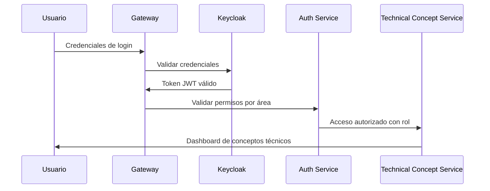
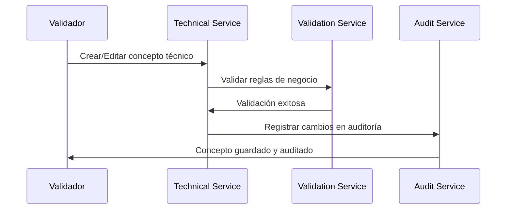

# Catálogo de Conceptos Técnicos - Gobierno de Tabasco

Sistema integral de gestión de conceptos técnicos para el CUBS (Catálogo Único de Bienes y Servicios) del Gobierno de Tabasco, basado en arquitectura de microservicios con Spring Boot y autenticación centralizada mediante Keycloak.

## 🎯 Objetivo del Proyecto

Crear un **sistema centralizado** que permita a los empleados del Gobierno de Tabasco gestionar y validar conceptos técnicos del CUBS mediante un proceso de autenticación seguro y control de acceso por áreas de trabajo.

## 🏛️ Contexto Gubernamental

**Cliente**: Gobierno de Tabasco - CGMAIG  
**Propósito**: Sistema de gestión de conceptos técnicos para el CUBS  
**Alcance**: Validación y control de conceptos técnicos por área de trabajo  

### Funcionalidades Principales
- 📋 **Gestión de Conceptos Técnicos**
- 🔍 **Validación Técnica por Área**
- 👥 **Control de Acceso por Roles**
- 📊 **Reportes y Auditoría**
- 🔐 **Autenticación con Keycloak**

## 🏗️ Arquitectura de Microservicios

```
┌─────────────────────────────────────────────────────────────┐
│              Catálogo de Conceptos Técnicos - CUBS         │
├─────────────────────────────────────────────────────────────┤
│  🌐 API Gateway (Spring Cloud Gateway + JWT)               │
│  📋 Config Server (Spring Cloud Config)                    │
│  📍 Service Discovery (Eureka Server)                      │
├─────────────────────────────────────────────────────────────┤
│  🔐 Auth Service (Keycloak Integration)                    │
│  📋 Technical Concept Service (CUBS Management)            │
│  👥 User Management Service (Roles y Permisos)            │
│  📊 Reporting Service (Auditoría y Métricas)              │
│  🔍 Validation Service (Verificación Técnica)             │
└─────────────────────────────────────────────────────────────┘
```

## 🔄 Flujo de Autenticación y Autorización

### 1. Proceso de Autenticación


### 2. Proceso de Gestión de Conceptos


## 📋 Base de Datos - Modelo de Conceptos Técnicos

### Estructura Principal
```sql
CREATE TABLE technical_concepts (
    id BIGINT PRIMARY KEY AUTO_INCREMENT,
    name VARCHAR(255) NOT NULL,
    description TEXT,
    area VARCHAR(100) NOT NULL,
    chapter VARCHAR(100) NOT NULL,
    unit_measure VARCHAR(50),
    specifications TEXT,
    status ENUM('ACTIVO', 'INACTIVO') DEFAULT 'ACTIVO',
    created_by VARCHAR(100) NOT NULL,
    created_at TIMESTAMP DEFAULT CURRENT_TIMESTAMP,
    updated_by VARCHAR(100),
    updated_at TIMESTAMP DEFAULT CURRENT_TIMESTAMP ON UPDATE CURRENT_TIMESTAMP,
    
    UNIQUE KEY unique_name_area (name, area),
    INDEX idx_area_chapter (area, chapter),
    INDEX idx_status (status),
    INDEX idx_created_by (created_by)
);
```

## 🚀 Componentes del Sistema

### 🌐 Gateway Service
- **Puerto**: 8080
- **Responsabilidad**: Punto de entrada único, balanceador de carga, rate limiting
- **Tecnología**: Spring Cloud Gateway + OAuth2

### 📋 Config Server
- **Puerto**: 8888
- **Responsabilidad**: Gestión centralizada de configuraciones
- **Repositorio**: Git para versionado de configuraciones

### 📍 Service Discovery
- **Puerto**: 8761
- **Responsabilidad**: Registro y descubrimiento de servicios
- **Tecnología**: Eureka Server

### 🔐 Authentication Service
- **Puerto**: 8081
- **Responsabilidad**: Integración con Keycloak, validación de tokens JWT
- **Base de datos**: PostgreSQL

### 📋 Technical Concept Service  
- **Puerto**: 8083
- **Responsabilidad**: Gestión completa de conceptos técnicos del CUBS
- **Funcionalidades**:
  - CRUD de conceptos técnicos
  - Validación por área y capítulo
  - Control de acceso por roles
  - Auditoría de cambios
  - APIs RESTful con paginación

### 👥 User Management Service
- **Puerto**: 8082  
- **Responsabilidad**: Gestión de usuarios y roles del sistema
- **Funcionalidades**:
  - Perfiles de usuario
  - Asignación de roles por área
  - Control de permisos
  - Integración con Keycloak

### 📊 Reporting Service
- **Puerto**: 8084
- **Responsabilidad**: Generación de reportes y métricas del CUBS
- **Funcionalidades**:
  - Reportes de conceptos por área
  - Estadísticas de validación
  - Dashboard de métricas
  - Exportación en múltiples formatos

### 🔍 Validation Service
- **Puerto**: 8085
- **Responsabilidad**: Validación técnica y reglas de negocio
- **Funcionalidades**:
  - Validación de unicidad por área
  - Verificación de relación área-capítulo
  - Control de formatos y especificaciones
  - Auditoría de validaciones

### 📡 Notification Service
- **Puerto**: 8086  
- **Responsabilidad**: Gestión de notificaciones del sistema
- **Funcionalidades**:
  - Notificaciones de cambios
  - Alertas de validación
  - Comunicación por email
  - Logs de actividad

## ⚙️ Configuración de Keycloak

### Realm: `nucleo-dash-realm`
```yaml
Realm Settings:
  - Realm Name: nucleo-dash-realm
  - Display Name: "CUBS - Catálogo Conceptos Técnicos"
  - Login Theme: nucleo-dash-theme
  - Token Settings: JWT válidos por 5 minutos
  
Clients:
  - nucleo-dash-back-client: Confidential client para API Gateway
  - nucleo-dash-web-client: Public client para frontend
  - technical-concept-client: Client específico para conceptos técnicos
  
User Federation:
  - LDAP: Integración con Active Directory gubernamental
  - Database: Vista de empleados activos
  
Identity Providers:
  - SAML: Integración con sistemas federales
  - OAuth2: Integración con nucleo.rocks
```

### Roles y Permisos
```yaml
Realm Roles:
  - VALIDADOR_TECNICO_CGMAIG: Validador técnico de CGMAIG
  - CONSULTOR_CUBS: Consulta conceptos técnicos
  - ADMIN_SISTEMA: Administrador del sistema
  - AUDITOR: Acceso de solo lectura para auditoría
  
Client Roles (por área):
  technical-concept-service:
    - CONCEPT_CREATE: Crear conceptos técnicos
    - CONCEPT_READ: Leer conceptos técnicos
    - CONCEPT_UPDATE: Actualizar conceptos técnicos
    - CONCEPT_DELETE: Eliminar conceptos técnicos
    - CONCEPT_VALIDATE: Validar conceptos técnicos
```

## 🛠️ Instalación y Configuración

### Prerrequisitos
```bash
- Java 17+
- Maven 3.8+
- Docker & Docker Compose
- MySQL/PostgreSQL 13+
- Keycloak 21+
```

### Configuración del Entorno

#### 1. Variables de Entorno
```bash
# Database
export DB_HOST=localhost
export DB_PORT=5432
export DB_NAME=acceso_tabasco_dev
export DB_USER=postgres
export DB_PASSWORD=activo

# Keycloak
export KEYCLOAK_URL=https://auth.nucleo.rocks
export KEYCLOAK_REALM=nucleo-dash-realm
export KEYCLOAK_CLIENT_SECRET=od5xYtQfHjRM5VUvSvBZkmiHZfhKCRQW

# Services
export CONFIG_SERVER_URL=http://localhost:8888
export EUREKA_SERVER_URL=http://localhost:8761
```

#### 2. Docker Compose para Desarrollo
```yaml
version: '3.8'
services:
  postgresql:
    image: postgres:13
    environment:
      POSTGRES_PASSWORD: activo
      POSTGRES_DB: acceso_tabasco_dev
    ports:
      - "5432:5432"
  
  keycloak:
    image: quay.io/keycloak/keycloak:21.0
    environment:
      KEYCLOAK_ADMIN: admin
      KEYCLOAK_ADMIN_PASSWORD: admin123
    ports:
      - "8180:8080"
    command: start-dev
  
  eureka:
    build: ./eureka-server
    ports:
      - "8761:8761"
  
  config-server:
    build: ./config-server
    ports:
      - "8888:8888"
    environment:
      - SPRING_CLOUD_CONFIG_SERVER_GIT_URI=https://github.com/tabasco-gov/config-repo
```

### Comandos de Ejecución

#### Desarrollo Local

**Iniciar con Docker (Recomendado):**
```powershell
# Windows - Servicios básicos
powershell -ExecutionPolicy Bypass -File scripts/docker/start-services.ps1 basic

# Windows - Todos los servicios
powershell -ExecutionPolicy Bypass -File scripts/docker/start-services.ps1 full
```

```bash
# Linux/Mac - Servicios básicos
chmod +x scripts/docker/start-services.sh
scripts/docker/start-services.sh basic

# Linux/Mac - Todos los servicios
scripts/docker/start-services.sh full
```

**Manual con Docker Compose:**
```bash
# Servicios básicos (Discovery + Config + Gateway)
docker-compose up --build -d discovery-service config-server gateway-service

# Todos los servicios
docker-compose --profile full up --build -d

# Verificar servicios
curl http://localhost:8761    # Eureka Dashboard
curl http://localhost:8888/actuator/health  # Config Server
curl http://localhost:8080/actuator/health  # Gateway
```

#### Producción
```bash
# Build all services
./mvnw clean package

# Deploy con Docker
docker-compose -f docker-compose.prod.yml up -d
```

## 📱 APIs y Endpoints

### Gateway (Puerto 8080)
```http
GET    /actuator/health                    # Health check del gateway
POST   /auth/login                         # Login de usuarios
GET    /auth/profile                       # Perfil del usuario autenticado
GET    /concepts/**                        # Proxy hacia Technical Concept Service
POST   /concepts/**                        # Proxy hacia Technical Concept Service
GET    /validation/**                      # Proxy hacia Validation Service
POST   /validation/**                      # Proxy hacia Validation Service
```

### Technical Concept Service (Puerto 8083)
```http
GET    /api/concepts                    # Listar conceptos técnicos (paginado)
POST   /api/concepts                    # Crear nuevo concepto técnico
GET    /api/concepts/{id}               # Obtener concepto por ID
PUT    /api/concepts/{id}               # Actualizar concepto técnico
DELETE /api/concepts/{id}               # Eliminar concepto técnico
GET    /api/concepts/by-area/{area}     # Filtrar conceptos por área
GET    /api/concepts/validate           # Validar concepto técnico
```

### Validation Service (Puerto 8085)
```http
GET    /api/validation/health           # Health check del validation service
POST   /api/validation/concept          # Validación completa de concepto técnico
POST   /api/validation/uniqueness       # Validación de unicidad por área
POST   /api/validation/area-chapter     # Validación de relación área-capítulo
POST   /api/validation/format           # Validación de formatos y especificaciones
GET    /api/validation/rules            # Obtener reglas de validación activas
GET    /api/validation/rules/{type}     # Obtener reglas por tipo de validación
```

### Auth Service (Puerto 8081)  
```http
POST   /api/auth/login          # Autenticación con Keycloak
GET    /api/auth/profile        # Información del usuario autenticado
POST   /api/auth/logout         # Cerrar sesión
GET    /api/auth/validate-token # Validar token JWT
```

## 🔒 Seguridad y Compliance

### Medidas de Seguridad
- ✅ Autenticación JWT con Keycloak
- ✅ Validación dual (Gateway + Servicios)
- ✅ Cifrado de datos en tránsito (TLS 1.3)
- ✅ Control de acceso por roles y áreas
- ✅ Logs de auditoría de cambios
- ✅ Rate limiting en Gateway
- ✅ Validación de reglas de negocio

### Compliance Gubernamental
- 📋 Cumple con la Ley General de Protección de Datos Personales
- 📋 Trazabilidad completa de cambios en conceptos técnicos
- 📋 Auditorías automáticas de validaciones
- 📋 Control de versiones y cambios
- 📋 Reportes de cumplimiento CUBS

## 📊 Monitoreo y Observabilidad

### Métricas (Micrometer + Prometheus)
- Tiempo de respuesta por servicio
- Número de autenticaciones exitosas/fallidas  
- Conceptos técnicos creados/modificados por día
- Validaciones exitosas/fallidas por área
- Distribución de conceptos por capítulo

### Logs Centralizados (ELK Stack)
- Logs de autenticación y autorización
- Logs de operaciones CRUD en conceptos
- Logs de validaciones técnicas
- Logs de auditoría de cambios
- Logs de errores por servicio

### Alertas
- Fallos de autenticación masivos
- Servicios Technical Concept no disponible
- Validaciones fallidas recurrentes
- Intentos de acceso no autorizados
- Creación masiva de conceptos (posible anomalía)

## 📞 Soporte y Contacto

**Equipo de Desarrollo**: Coordinación General de Modernización Administrativa e Innovación Gubernamental (CGMAIG)

**Mesa de Ayuda TI**: `soporte-cubs@tabasco.gob.mx`

**Documentación Técnica**: Disponible en repositorio interno

**Sistema Keycloak**: `https://auth.nucleo.rocks`

---

*Este sistema está diseñado para fortalecer la gestión de conceptos técnicos del CUBS en el Gobierno de Tabasco, garantizando validación técnica, trazabilidad completa y cumplimiento de las especificaciones gubernamentales.*